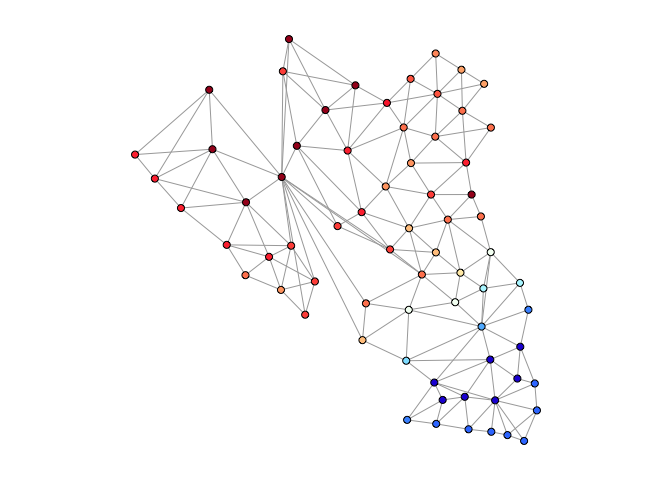
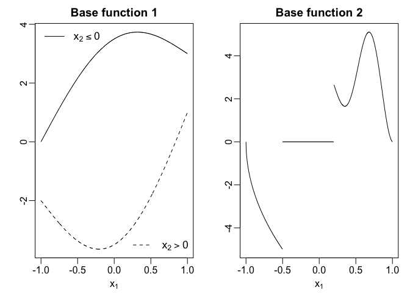
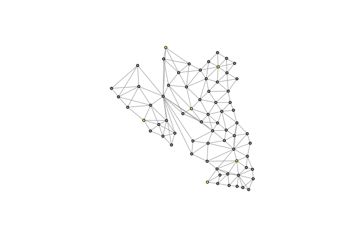

network_linked_regression
================
2023-05-12

## Overview

In this example, we show how to use `flexBART::network_BART` for
network-linked regression. At each vertex $v$ of a given network
$\mathcal{G},$ we observe $n_{v}$ covariate-response pairs
$(\boldsymbol{x}_{vt}, y_{vt})$ of a $p$-dimensional covariate vector
$\boldsymbol{x}_{vt} \in [-1,1]^{p}$ and a scalar response $y.$ We
further model $$
  y_{vt} \sim \mathcal{N}(f(\mathbf{x}_{vt},v), \sigma^{2})
$$ where $f: [-1,1]^{p} \times V(\mathcal{G}) \rightarrow \mathbb{R}$ is
an unknown regression function. Implicit in our notation is the
assumption that the regression relationship is not necessarily the same
at every vertex.

One option to learning $f$ is to fit separate BART models to the
observations at each vertex (i.e. use the
$(\boldsymbol{x}_{vt}, y_{vt})$ pairs to estimate the function
$f(\boldsymbol{x}, v)$ for each $v$). Because it models the data at each
vertex completely independently, such a strategy is unable to exploit
network smoothness, in the sense that for two adjacent vertices
$v \sim v',$ we might have
$f(\boldsymbol{x}, v) \approx f(\boldsymbol{x},v').$ In the presence of
such smoothness, it may be desirable to “partially pool” the
observations across adjacent vertices. We now demonstrate how
`flexBART::network_BART` can perform such partial pooling using the
available adjacency information.

To this end, we will simulate data on a real network that encodes the
spatial adjacency of a subset of the 2010 Census tracts in the city of
Philadelphia. The file `network_linked_regression_data.RData` contains
an **igraph** object containing this network, a nice layout matrix, for
plotting, and the adjacency matrix for this network.

``` r
library(igraph)
```

    ## 
    ## Attaching package: 'igraph'

    ## The following objects are masked from 'package:stats':
    ## 
    ##     decompose, spectrum

    ## The following object is masked from 'package:base':
    ## 
    ##     union

``` r
load("network_linked_regression_data.RData")
col_list <- colorBlindness::Blue2DarkRed18Steps
my_colors <- c("#999999", "#E69F00", "#56B4E9", "#009E73", "#F0E442", "#0072B2",
    "#D55E00", "#CC79A7")
```

We can visualize the network using a couple of different layouts

``` r
n <- nrow(A)  # number of vertices
cols <- rep(my_colors[1], times = n)
V(g)$color <- cols

par(mar = c(1, 1, 1, 1), mgp = c(1.8, 0.5, 0), mfrow = c(1, 3))


plot(g, layout = layout_nicely, vertex.size = 3.5, vertex.label.size = 2.5, main = "layout_nicely()")
plot(g, layout = layout_in_circle, vertex.size = 3.5, vertex.label.size = 2.5, main = "layout_in_circle()")
plot(g, layout = my_layout, vertex.size = 3.5, vertex.label.size = 2.5, main = "Our layout")
```

<!-- -->

## Data Generation

We will generate $n_{v} = 250$ observations at each vertex using the
following steps

1.  Create two connected clusters (`cluster1` and `cluster2`), each
    containing a small number of vertices.
2.  For all vertices in the network, compute the shortest path distances
    between that vertex and each of `cl1` and `cl2`. Denote these
    distances $d_{i1}$ and $d_{i2}.$
3.  Define the weight of vertex $v$ as
    $w_{v} = d_{i2}/(d_{i1} + d_{i2}).$ Note that if $v$ is in `cl1`,
    $w_{v} = 0$ and if $v$ is in `cl2`, $w_{v} = 1.$ Vertices with
    weight larger than 0.5 are, in some sense, closer to `cl2` than they
    are to `cl1.`
4.  Draw independent covariate vectors
    $\boldsymbol{x}_{v1}, \ldots, \boldsymbol{x}_{v250} \sim \mathcal{U}[-1,1]^{10}$
    at each vertex $v$ and generate
    $y_{vt} \sim \mathcal{N}(f(\boldsymbol{x}_{vt}), 1)$ where the true
    regression function $f$ is convex combination of two base functions
    where $\tilde{x}_{1} = (1 + x_{1})/2$ and
    $\tilde{x}_{2} = \boldsymbol{1}(X_{2} > 0).$

Here we form the clusters, compute the vertex weights, and then
visualize the weights of each vertex

``` r
cluster1 <- c(35, 37, 36, 40, 48, 44, 54, 67, 59)
cluster2 <- c(20, 2, 18, 17, 21, 15, 16)
cluster3 <- (1:n)[!(1:n) %in% c(cluster1, cluster2)]
dist_to_cl1 <- apply(igraph::distances(graph = g, to = cluster1), FUN = min, MARGIN = 1)
dist_to_cl2 <- apply(igraph::distances(graph = g, to = cluster2), FUN = min, MARGIN = 1)
total_dist <- dist_to_cl1 + dist_to_cl2
w <- dist_to_cl2/total_dist  # how much weight to give to f1
g_weight <- g
V(g_weight)$color <- rgb(colorRamp(col_list, bias = 1)(w)/255)
par(mar = c(1, 1, 1, 1), mgp = c(1.8, 0.5, 0))
plot(g_weight, layout = my_layout, vertex.label = NA, vertex.size = 3.5)
```

<!-- -->

We can now define the base functions $f_{1}$ and $f_{2}$ and plot them.

``` r
f1_true <- function(X_cont) {
    scaled_X_cont <- (X_cont + 1)/2  # moves it to [0,1]
    z1 <- scaled_X_cont[, 1]
    z2 <- 1 * (scaled_X_cont[, 2] > 0.5)
    return(3 * z1 + (2 - 5 * z2) * sin(pi * z1) - 2 * z2)
}
f2_true <- function(X_cont) {
    scaled_X_cont <- (X_cont + 1)/2
    return((3 - 3 * cos(6 * pi * scaled_X_cont[, 1]) * scaled_X_cont[, 1]^2) * (scaled_X_cont[,
        1] > 0.6) - (10 * sqrt(scaled_X_cont[, 1])) * (scaled_X_cont[, 1] < 0.25))
}
mu_true <- function(X_cont, vertex_id) {
    tmp1 <- f1_true(X_cont)
    tmp2 <- f2_true(X_cont)
    tmp_w <- w[vertex_id]
    return(tmp_w * tmp1 + (1 - tmp_w) * tmp2)
}
```

``` r
x1_seq <- seq(-1, 1, length = 1001)
x_plot <- cbind(c(x1_seq, x1_seq), c(rep(-0.5, times = 1001), rep(0.5, times = 1001)))
f1_plot <- f1_true(x_plot)
par(mar = c(3, 3, 2, 1), mgp = c(1.8, 0.5, 0), mfrow = c(1, 2))
plot(x1_seq, f1_plot[1:1001], type = "l", xlim = c(-1, 1), ylim = range(f1_plot),
    xlab = expression(x[1]), ylab = "", main = "Base function 1")
lines(x1_seq, f1_plot[1002:2002], lty = 2)
legend("bottomright", legend = expression(x[2] > 0), lty = 2, bty = "n", cex = 1.1)
legend("topleft", legend = expression(x[2] <= 0), lty = 1, bty = "n", cex = 1.1)

f2_plot <- f2_true(x_plot[1:1001, ])
z1_seq <- (1 + x1_seq)/2
plot(1, type = "n", xlim = c(-1, 1), ylim = range(f2_plot), xlab = expression(x[1]),
    ylab = "", main = "Base function 2")
lines(x1_seq[z1_seq < 0.25], f2_plot[z1_seq < 0.25])
lines(x1_seq[z1_seq >= 0.25 & z1_seq < 0.6], f2_plot[z1_seq >= 0.25 & z1_seq < 0.6])
lines(x1_seq[z1_seq > 0.6], f2_plot[z1_seq > 0.6])
```

<!-- -->

## Experimental Setup

Now that we have defined the functions, we will generate $n_{v} = 250$
observations at each vertex. To make things interesting, we will train
our model using data from only 90% of all vertices. We will interested
in understanding how well we can recover $f$ when we (i) have observed
data at vertex $i$ and (ii) when we have not observed data at vertex
$i$. Note: when training our model, we will use the full adjacency
information. This way we can assess how well our model leverages the
adjacency structure to predict $f$ at the held-out vertices.

To compare our results with **BART**, which cannot account for any
adjacency information, we create a data frame `X_bart_train`, which
records the vertex label as a categorical variable (i.e. as a factor).

``` r
set.seed(512)
n_v <- 200  # how many observations per tract
vertex_id_all <- rep(1:n, each = n_v)
p <- 10
X_cont_all <- matrix(runif(n * n_v * p, min = -1, max = 1), ncol = p)
X_cat_all <- matrix(vertex_id_all - 1, ncol = 1)
X_bart_all <- data.frame(X_cont_all, factor(vertex_id_all))
mu_all <- mu_true(X_cont_all, vertex_id_all)
sigma <- 1
Y_all <- mu_all + sigma * rnorm(n * n_v, mean = 0, sd = 1)
test_vertices <- sample(1:n, size = floor(0.1 * n), replace = FALSE)
train_vertices <- (1:n)[-test_vertices]
train_index <- which(vertex_id_all %in% train_vertices)
Y_train <- Y_all[train_index]
vertex_id_train <- vertex_id_all[train_index]
X_cont_train <- X_cont_all[train_index, ]
X_cat_train <- matrix(X_cat_all[train_index, ], ncol = 1)
X_bart_train <- X_bart_all[train_index, ]
mu_train <- mu_all[train_index]
```

To evaluate how we well can estimate $f(\boldsymbol{x},v)$
out-of-sample, we generate $500$ more observations at each vertex. We
will evaluate performance using two sets of vertices, those which
appeared in the training dataset (`Test1` in the code below) and those
which did not (`Test2` in the code below).

``` r
n_test <- 500
X_cont_test <- matrix(runif(n * n_test * p, min = -1, max = 1), ncol = p)
X_cat_test <- matrix(rep(1:n, each = n_test) - 1, ncol = 1)
vertex_id_test <- rep(1:n, each = n_test)
X_bart_test <- data.frame(X_cont_test, factor(vertex_id_test))

mu_test <- mu_true(X_cont_test, vertex_id_test)

test_index_1 <- which(vertex_id_test %in% train_vertices)
test_index_2 <- which(vertex_id_test %in% test_vertices)
```

Here is a plot of the training (gray) and testing vertices (yellow).

``` r
g_train <- g
training_cols <- rep(my_colors[1], times = n)
training_cols[test_vertices] <- my_colors[5]
V(g_train)$color <- training_cols
plot(g, layout = my_layout, vertex.size = 3.5, vertex.label = NA)
```

<!-- -->

Finally, we’re going to want to evaluate the RMSE and coverage of the
95% posterior credible intervals.

``` r
######## Two helper functions
compute_rmse <- function(truth, est) {
    return(sqrt(mean((truth - est)^2)))
}
compute_cov <- function(truth, samples) {
    l95 <- apply(samples, FUN = quantile, MARGIN = 2, probs = 0.025)
    u95 <- apply(samples, FUN = quantile, MARGIN = 2, probs = 0.975)

    return((mean((truth >= l95) & (truth <= u95))))
}
###########

rmse <- matrix(NA, nrow = 2, ncol = 3, dimnames = list(c("flexBART", "BART"), c("Train",
    "Test1", "Test2")))

coverage <- rmse
```

## Model fitting

We’re now ready to fit our models.

``` r
flexBART_timing <- system.time(flexBART_fit <- flexBART::network_BART(Y_train = Y_train,
    vertex_id_train = vertex_id_train, X_cont_train = X_cont_train, vertex_id_test = vertex_id_test,
    X_cont_test = X_cont_test, A = A))
```

``` r
BART_timing <- system.time(bart_fit <- BART::wbart(x.train = X_bart_train, y.train = Y_train,
    x.test = X_bart_test, sparse = FALSE, ndpost = 1000, nskip = 1000))
```

``` r
rmse["flexBART", "Train"] <- compute_rmse(mu_train, flexBART_fit$yhat.train.mean)
rmse["BART", "Train"] <- compute_rmse(mu_train, bart_fit$yhat.train.mean)

rmse["flexBART", "Test1"] <- compute_rmse(mu_test[test_index_1], flexBART_fit$yhat.test.mean[test_index_1])
rmse["BART", "Test1"] <- compute_rmse(mu_test[test_index_1], bart_fit$yhat.test.mean[test_index_1])

rmse["flexBART", "Test2"] <- compute_rmse(mu_test[test_index_2], flexBART_fit$yhat.test.mean[test_index_2])
rmse["BART", "Test2"] <- compute_rmse(mu_test[test_index_2], bart_fit$yhat.test.mean[test_index_2])

coverage["flexBART", "Train"] <- compute_cov(mu_train, flexBART_fit$yhat.train)
coverage["BART", "Train"] <- compute_cov(mu_train, bart_fit$yhat.train)

coverage["flexBART", "Test1"] <- compute_cov(mu_test[test_index_1], flexBART_fit$yhat.test[,
    test_index_1])
coverage["BART", "Test1"] <- compute_cov(mu_test[test_index_1], bart_fit$yhat.test[,
    test_index_1])

coverage["flexBART", "Test2"] <- compute_cov(mu_test[test_index_2], flexBART_fit$yhat.test[,
    test_index_2])
coverage["BART", "Test2"] <- compute_cov(mu_test[test_index_2], bart_fit$yhat.test[,
    test_index_2])
```

## Results

Here are the RMSE, uncertainty interval coverage, and timing results.

``` r
print(round(rmse, digits = 3))
print(round(coverage, digits = 3))
print(round(c(flexBART = flexBART_timing["elapsed"], BART = BART_timing["elapsed"]),
    digits = 3))
```

    ##          Train Test1 Test2
    ## flexBART 0.333 0.346 0.471
    ## BART     0.512 0.543 1.354
    ##          Train Test1 Test2
    ## flexBART 0.842 0.829 0.825
    ## BART     0.594 0.574 0.194
    ## flexBART.elapsed     BART.elapsed 
    ##           85.402          139.472
